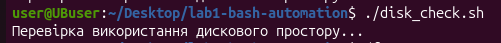
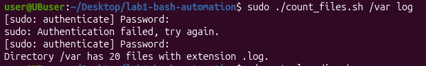
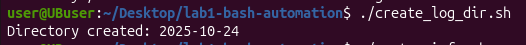
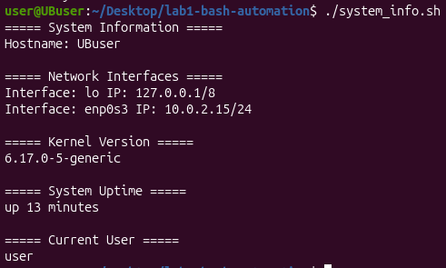

# Лабораторна робота №1  
## **Тема:** Автоматизація за допомогою Bash  

### **Мета роботи:**  
Ознайомитися з основами створення Bash-скриптів і навчитися автоматизувати системні завдання: моніторинг ресурсів, підрахунок файлів, створення директорій та збір системної інформації.

---

## Хід роботи

---

### Завдання 1. Перевірка використання дискового простору
**Умова:**  
Створити скрипт, який перевіряє використання дискового простору.  
Якщо вільного місця менше 10% — вивести попередження.

**Файл:** `disk_check.sh`

```bash
#!/bin/bash
# Скрипт перевіряє використання дискового простору

THRESHOLD=10

echo "Перевірка використання дискового простору..."
df -h | awk 'NR>1 {print $5, $6}' | while read output; do
  usep=$(echo $output | awk '{print $1}' | tr -d '%')
  partition=$(echo $output | awk '{print $2}')
  if [ $usep -ge $((100 - THRESHOLD)) ]; then
    echo "УВАГА: На розділі $partition залишилося менше $THRESHOLD% вільного місця!"
  fi
done
```

**Результат виконання:**  


---

### Завдання 2. Підрахунок файлів певного типу
**Умова:**  
Створити скрипт, який підраховує кількість файлів певного розширення у заданій директорії.  
Скрипт приймає два аргументи:  
1. шлях до директорії  
2. розширення файлу  

**Файл:** `count_files.sh`

```bash
#!/bin/bash
# Скрипт підраховує кількість файлів заданого типу

if [ $# -ne 2 ]; then
  echo "Використання: $0 <шлях_до_директорії> <розширення>"
  exit 1
fi

DIR=$1
EXT=$2

if [ ! -d "$DIR" ]; then
  echo "Помилка: директорія $DIR не існує!"
  exit 1
fi

COUNT=$(find "$DIR" -type f -name "*.$EXT" | wc -l)
echo "Directory $DIR has $COUNT files with extension .$EXT."
```

**Приклад виконання:**
```bash
./count_files.sh /var log
```

**Результат виконання:**  


---

### Завдання 3. Створення директорії за поточною датою
**Умова:**  
Написати скрипт, який створює нову директорію з ім’ям поточної дати у форматі `YYYY-MM-DD`.

**Файл:** `create_log_dir.sh`

```bash
#!/bin/bash
# Скрипт створює директорію з поточною датою

DIRNAME=$(date +%F)

if [ -d "$DIRNAME" ]; then
  echo "Directory exists: $DIRNAME"
else
  mkdir "$DIRNAME"
  echo "Directory created: $DIRNAME"
fi
```

**Результат виконання:**  


---

### Завдання 4. Діагностика системи
**Умова:**  
Створити скрипт, який виводить основну інформацію про систему:  
- ім’я хоста  
- IP-адреси  
- версію ядра Linux  
- час роботи системи  
- поточного користувача  

**Файл:** `system_info.sh`

```bash
#!/bin/bash
# Скрипт збирає інформацію про систему

echo "===== System Information ====="
echo "Hostname: $(hostname)"
echo
echo "===== Network Interfaces ====="
ip -o -4 addr show | awk '{print "Interface:", $2, "IP:", $4}'
echo
echo "===== Kernel Version ====="
uname -r
echo
echo "===== System Uptime ====="
uptime -p
echo
echo "===== Current User ====="
whoami
```

**Результат виконання:**  


---

## Висновки
У ході виконання лабораторної роботи №1 було створено чотири Bash-скрипти, які автоматизують типові завдання системного адміністратора в середовищі Linux. Робота дала змогу глибше ознайомитися з можливостями Bash, навчитися створювати та налагоджувати сценарії для виконання рутинних операцій.

Під час виконання лабораторної було засвоєно принципи побудови Bash-скриптів, зокрема використання умовних операторів, циклів, змінних і передачі аргументів через командний рядок. Було опрацьовано команди df, find, date, ip, uname, uptime, whoami, які є базовими інструментами системного адміністратора. Також відпрацьовано навички роботи з потоками введення-виведення, обробкою текстових даних за допомогою утиліт awk і grep, а також форматування виводу інформації.

У результаті виконання завдань сформовано розуміння того, як за допомогою Bash можна ефективно автоматизувати повсякденні процеси адміністрування системи, зменшити кількість ручних дій і підвищити стабільність роботи середовища. Отримані знання та практичні навички створюють основу для подальшого вивчення системного адміністрування, автоматизації серверних процесів і впровадження DevOps-підходів.

---

## 🧑‍💻 Автор
**Ім'я:** *Yaroslav*   
**Дата виконання:** 24.10.2025  
